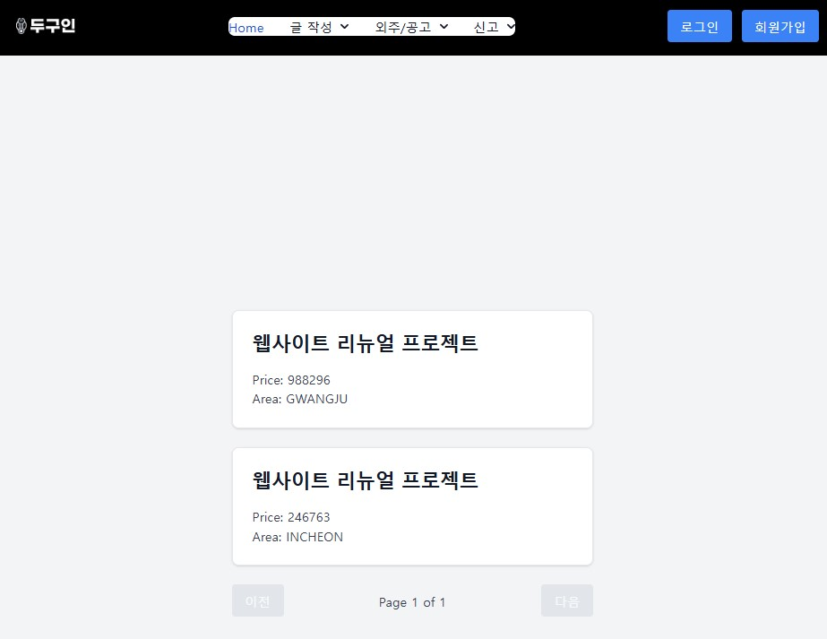

# DOGUIN

---

  

   

# 🧑🏻‍💻 Community & Outsourcing Web Page [1.0]

---
> 개발 기간 : 2024.10.21(월) ~ 2024.11.22(금)

## 🐱 배포 주소

---
> [도구인 웹 사이트](https://doguin-f.vercel.app/)

## ✋🏻 프로젝트 소개

---
`도구인`은 개발자 커뮤니티와 개발 외주&수주를 한번에 지원하는 웹 사이트 입니다.

개발자가 되고자 하는 사람들과 주니어 개발자들이 다양한 카테고리의 게시글을 통해 정보를 얻고, 시니어 개발자들은 각자의 경험과 지식을 공유하며 개발 실력을 함께 발전시키는 것을 목표로 합니다.

또한, 특정 프로젝트에서 개발이 필요한 사람들을 위한 외주 매칭 시스템도 제공합니다. 개발과는 거리가 있는 쇼핑몰 운영자나 비즈니스 소유자라도 효과적인 업무 성과를 위해 개발자와 쉽게 연결될 수 있도록 지원합니다.

### 개발 환경

| 이름                                                                                                                        | 버전                                        |
|---------------------------------------------------------------------------------------------------------------------------|-------------------------------------------|
|  | IntelliJ IDEA 2024.1.4 (Ultimate Edition) |
|               | 3.3.4                                     |
|                           | 17                                        |

## STACK

---

### Environment

 

### Config

### Development

   

### Communication

  

### Deploy

# 🖥️ 화면 구성

---

- ### 회원가입/로그인 화면
 

- ### 모든 게시글 작성 화면

- ### 외주 작성 화면

- ### 포트폴리오 작성 화면

- ### 채용/공고 화면

- ### 매칭 목록 화면

# 🔫 아키텍쳐

---

ver 1

ver 2

MSA 구조를 통해 시스템의 확장성과 안정성을 확보하고자 한 구조다.
본 구조의 문제점은 다음과 같다.
1. 프로젝트 스코프에 비해 과한 구조이다.

ver 3 (Now)

기능 스코프에 맞춰 채팅, 접속 상태, 알림등을 API 서버와 통합하여 단일 서버로 지원하기로 했다.

사용자 경험을 위해 내장 캐시와 글로벌 캐시를 적용하였고, 데이터의 안전을 위해서 DB 이중화 구조로 변경하였다.

# ✏️ 인프라 설계도

---

# ✨ 주요 기능

---
[API 명세 바로가기](https://github.com/DogUin-Community/doguin/blob/dev/api.MD)
---

1. 커뮤니티

- ### 자유 게시판 : 
  - 사용자가 자유롭게 의견을 공유하고 정보를 나눌 수 있는 공간입니다.
  - 기능: 게시글 작성, 댓글 달기, 좋아요 기능 제공
- ### 질문 게시판
  - 개발 관련 질문과 답변을 나누는 공간으로, 유저들이 지식을 공유할 수 있도록 합니다.
  - 기능: 질문 작성, 답변 작성, 채택 기능 및 베스트 답변 표시로 유용한 정보를 강조
- ### 1대1 문의 게시판
  - 1대1 문의가 가능한 공간으로, 개인화된 질문과 답변을 위한 게시판입니다.
  - 기능: 개인별 문의 작성 및 답변 제공, 실시간 답변 알림 기능
- ### 공지 게시판
  - 중요하거나 공지할 사항을 유저들에게 전달하는 공간입니다.
  - 기능: 공지 작성, 수정, 삭제, 공지사항 목록 조회 및 상세 조회
- ### 신고 관리
  - 사용자가 부적절한 게시물이나 유저를 신고할 수 있는 기능입니다.
  - 기능: 신고 생성, 신고 처리, 신고 내역 조회 및 검색

2. 외주

- ### 외주 의뢰 등록 및 관리
  - 사용자가 프로젝트를 의뢰하고 관리할 수 있는 공간입니다.
  - 기능: 외주 의뢰 등록, 수정, 삭제, 의뢰 현황 조회 및 신청 현황 관리
- ### 외주 검색 및 신청
  - 사용자가 원하는 외주 프로젝트를 검색하고 지원할 수 있는 공간입니다.
  - 기능: 키워드 검색, 필터링(카테고리, 지역 등), 외주 상세 보기 및 신청하기
- ### 포트폴리오 관리
  - 사용자가 자신의 포트폴리오를 작성하고 관리할 수 있는 공간입니다.
  - 기능: 포트폴리오 작성, 수정, 삭제, 포트폴리오 목록 조회 및 상세 보기
- ### 매칭 관리
  - 외주 의뢰와 포트폴리오 간의 매칭을 관리하는 공간입니다.
  - 기능: 매칭 생성, 수정, 삭제, 매칭된 목록 조회

# ✅ 적용 기술

---

 WebSocket

> **선택 근거**
> 
> - 실시간 데이터 통신을 위해 HTTP 기반의 요청-응답 패턴보다 효율적인 비동기 양방향 통신이 필요하다. 본 프로젝트의 채팅 기능은 사용자의 메시지 전송 및 수신이 즉각적으로 이루어져야 하며, 채팅의 특성을 위해 클라이언트와 서버 간의 지속적인 연결을 유지하는 것이 중요하다. WebSocket은 이러한 요구 사항을 충족하며, STOMP 프로토콜을 활용하여 채팅 메시지의 발행과 구독을 손쉽게 구현할 수 있기 때문에 선택했다.
>
> **목적**
> 
> - 실시간 1:1 채팅 및 사용자 참여 상태 관리를 구현하기 위함이다. 특히, 사용자들이 빠르게 메시지를 주고받고 채팅방의 변화를 실시간으로 반영할 수 있어 사용자 경험을 향상시킬 수 있다. 또한, WebSocket을 활용함으로써 채팅방 참여 및 나가기 시의 사용자 상태 관리와 Redis를 통한 메시지 발행 및 구독 기능을 구현하여 안정적이고 확장 가능한 실시간 채팅 기능을 제공한다.

WebFlux

> **선택 근거**
>
> - 본 프로젝트에 비동기를 적용하는 부분은 슬랙 챗봇을 통한 1대1 DM 보내기, Slack 서버에 Email을 보내 ID를 반환받기 부분이다. 해당 기능은 외부 API호출로 작업 요청 후 즉시 다음 작업을 수행할 수 있는 논블로킹 IO이다. 비동기 구현 방식은 @Async와 WebFlux가 존재하는데 @Async는 블로킹 IO, WebFlux는 논블로킹 IO를 지원하기 때문에 WebFlux를 선택했다.
>
> **목적**
>
> - 특정 인물이 게시글 등록시 그를 Follow 하는 전체에게 1대1 DM이 전송된다. 동기적으로 본 기능을 작동할 시 가장 먼저 DM을 받는 사람과 마지막에 DM을 받는 사람의 시점이 유의미하게 차이가 난다고 판단되었다. 또한 동기식으로 해당 기능 구현시 Follow하는 사람이 많으면 이메일 전체 전송까지 많은 시간 소모가 되기 때문에 두 가지 문제를 비동기를 통해 해결하고자 도입했다.

Redis

> **선택 근거**
>
> - Reids는 Key:Value 형태로 데이터를 저장하는 DB이다. Value 형태는 Java의 Collection 형태를 지원하는데, 이중 SET 구조를 이용한다면 중복을 제거한 상태의 데이터를 저장할 수 있다. 이를 이용하여 어뷰징을 방지하고자 한다. 또한 Redis는 In-Memory Cache로 디스크에 저장하는 DB보다 빠른 조회 속도를 제공한다. 이를 통해 상대적으로 조회를 많이 할 인기 게시글 목록을 빠르게 응답할 수 있다. 마지막으로 Redis는 Global Cache로 여러가지 서버에 동일한 데이터를 제공할 수 있기 때문에 어느 서버로 접속하더라도 동일한 인기글과 조회수를 응답받을 수 있다.
> 
> **목적**
>
> - 게시글의 조회수와 조회수를 기반으로한 인기 게시글 목록 구현을 위해 도입했다.

Ehcache

> **선택 근거**
>
> - 본 프로젝트에서 수정될 확률이 적은 데이터 혹은 개인화된 데이터의 조회속도를 개선하고자 했다. 이를 위해서 캐시를 사용하는데, 캐시에는 Local Cache와 Redis, MemCache와 같은 Global Cache 등이 있다. 본 데이터들을 네트워크 리소스가 발생하지 않은 Local Cache를 사용하는 것이 응답속도 면에서 유리하고 또한 각 서버가 캐시에 저장된 데이터가 다르더라도 문제가 없을 공지, 마이페이지 등을 저장하기 때문에 리소스 소모가 상대적으로 적은 Local Cache인 ehcache를 선택했다.
> 
> **목적**
>
> - 수정이 많이 발생하지 않은 데이터들의 빠른 응답을 위해 도입했다.

MongoDB

> **선택 근거**
>
> - 채팅 시스템이 다루는 데이터는 사용자 프로파일, 설정, 친구 목록과 같은 일반적 데이터와 채팅 시스템에 고유한 데이터인 채팅 이력이 있다. 전자의 경우 일반적인 데이터로 RDBMS에 저장 하게 된다. 하지만 후자의 경우 방대한 양을 제공한다. 또한 조회가 잦은 부분은 최근에 생성된 메시지 이지만 검색이나 언급을 통해 과거의 데이터에도 접근을 하게 된다. 이러한 기능들을 모두 제공하는 것이 키-값 저장소인데, 키-값 저장소는 수평적 규모 확장이 쉬우며 latency가 낮아 실시간성을 제공하는 채팅 시스템에 잘 어울린다. 이러한 이유로 NoSQL을 선택했고 여러 NoSQL중 개발자가 직접 사용해본 경험이 있는 MongoDB가 채택되었다.
>
> **목적**
>
> - 채팅 이력의 저장을 위해 도입했다.

Jenkins

> **선택 근거**
>
> - 두구인은 외주 기능을 포함하고 있어 보안이 중요한 프로젝트이며 외부 의존성을 줄이고, 내부 서버에서 안전하게 배포를 관리하기 위해 Jenkins를 선택했다.
>
> **목적**
>
> - Jenkin를 도입함으로써 외부 의존성을 최소화하여 내부 서버 환경에서 안전하고 신뢰할 수 있는 배포 관리를 실현하고 이를 통해 프로젝트의 보안성을 확보하며, 민감한 외주 기능을 안전하게 운영할 수 있도록 합니다.

# 🙌 핵심요약(Key-Summary)

---

## 1. 성능 개선 : Redis 싱글쓰레드 특성을 활용하여 동시성 제어 최적화
  1. **한 줄 요약**
     - Redis 싱글쓰레드 구조를 활용해 DB와 트랜잭션 부담을 줄여 평균 10ms의 요청 처리 속도를 달성했습니다.
     - 
     - 

  2. **도입 배경**
     - 회사 공고에 여러 사용자가 동시에 매칭 신청을 하면서 발생하는 동시성 제어 문제를 해결하고자 하였습니다.
     - 낙관적 락과 비관적 락의 성능이 한계에 도달해 보다 효과적인 해결 방안이 필요했습니다.

  3. **기술적 선택지**
     - **낙관적 락 사용**
       - DB 부하는 줄일 수 있었으나, 높은 동시성 처리 시 에러 발생
     - **비관적 락 사용**
       - 동시성 문제는 해결되었으나, 요청 속도가 느려짐
     - **Redis 싱글쓰레드 사용**
       - 큐에 요청을 쌓아 순차적으로 처리하여 빠른 응답 속도 제공
       - In-Memory 특성을 활용하여 요청 처리 속도 개선

  4. **결론**
     - Redis 기반의 싱글쓰레드 특성을 활용하여 요청 처리의 효율성을 크게 개선

## 2. 트러블 슈팅 : 캐시로 인한 게시글 조회수 미적용 문제 해결
1. **한 줄 요약**
    - 캐시 사용 시 로그인 상태에 따른 조회수 미적용 문제를 캐시 미적용 방식 전환 및 이벤트 리스너 활용으로 해결

2. **배경**
    - 게시글 조회 시 비로그인 상태에서 캐시에 조회 결과가 저장되면, 로그인 후 조회 시에도 조회수가 증가하지 않는 문제가 발생

3. **해결 방안**
    - **캐시 조건 변경**
      - 비로그인 조회 시 캐시에 저장하지 않도록 조건을 변경했으나 문제 해결에 한계 존재
    - **AOP 적용**
      - 단건 조회 시 AfterReturning AOP를 통해 조회수 증가 로직을 추가하였으나, 캐시가 적용된 이전 조회수가 반환되는 문제 발생
    - **캐시 미적용 전환 및 이벤트 리스너 활용 (최종 해결책)**
      - 캐시 적용을 포기하고 조회수 증가를 위해 이벤트 리스너로 조회수를 실시간으로 반영

4. **결론**
    - 이벤트 리스너로 조회수를 반영하도록 변경하여 로그인 상태에 따른 조회수 미적용 문제 해결

# 🔫 기술적 의사결정

---

## **1. Redis pub/sub 도입 이유**

>채팅 시스템의 실시간 반응성을 위해 Redis의 pub/sub 기능을 도입하여 메시지 전송 속도를 개선했습니다. Redis의 메모리 기반 저장소 특성이 실시간성이 필요한 채팅 기능에 적합하다고 판단했습니다.
> 
>[Redis pub/sub 도입 의사결정 상세 과정](https://www.notion.so/teamsparta/Redis-pub-sub-a16754602e75464eacc02f0ebb16b88f)

## **2. Redis 도입 이유**

>서비스에서 조회수가 증가할 때 발생하는 MySQL의 I/O 부하 문제를 해결하기 위해 Redis 캐시를 사용하여 성능을 개선했습니다. Redis는 높은 신뢰성과 성능을 가진 캐싱 도구로, 프로젝트 요구사항에 부합한다고 판단하여 도입했습니다.
> 
>[Redis 캐시 도입 의사결정 상세 과정](https://www.notion.so/teamsparta/Redis-65704bad26284bd28f1a4b755713ff76)

# 🔥 트러블 슈팅

---
## **BE) S3 이미지 업로드 속도 문제 해결**

>동기 방식으로 S3에 이미지를 업로드할 때, 100개의 이미지 처리에 약 11초가 소요되는 성능 문제가 발생했다.
>비동기 통신을 적용하여 업로드를 별도 쓰레드에서 처리하도록 하여 응답 속도를 0.19초로 개선했다.
> 
>[S3 이미지 업로드 속도 문제 해결 과정](https://www.notion.so/teamsparta/f9d8b2492ff144e6bec6f4ec1e5bde97)

## **BE) 조회수 증가 시 성능 저하 문제 해결**

>사용자가 특정 게시글에 접근할 때마다 조회수가 증가되면서, MySQL에 update 쿼리가 빈번히 발생해 disk I/O 작업의 오버헤드 가능성이 우려되었습니다.
>Redis의 InMemory 특성을 활용하여 조회수를 Redis에 저장하고, 특정 주기마다 스케줄러를 통해 MySQL에 일괄 저장하는 방식으로 성능을 개선했습니다.
> 
>[조회수 증가 시 성능 저하 문제 해결 과정](https://www.notion.so/teamsparta/Board-4a1207474d4a4fc9b1318f26eec7c20b)

## **BE) 매칭 신청시 동시성 제어 문제 해결**

>회사가 올린 공고에 대해 여러명의 유저가 한번에 신청 할 경우에 대비한 동시성 제어 처리 진행하며, 속도를 개선하였습니다.
> 
>[매칭 신청시 동시성 제어 문제 해결](https://teamsparta.notion.site/af79344805e24f2abdf899ac53461de4)

## **BE) 마이페이지 조회 성능 저하 문제 해결**

>마이페이지 조회 시 서버 부하로 인한 성능 저하를 해결하기 위해 ehcache를 적용하고, Locust로 성능 테스트를 진행했습니다.
>그 결과, 캐시 적용 후 평균 응답 시간이 약 22~30% 개선되었고, RPS 증가에도 안정적인 성능을 유지할 수 있었습니다.
>이를 통해 사용자 경험과 서버 성능이 모두 향상되었습니다.
> 
>[마이페이지 조회 성능 저하 문제 해결](https://ysh2.tistory.com/199)

## 😎 팀원 소개

---

유태이(리더)

- [유태이 깃허브](https://github.com/tiyu25)
- **담당**
  - **Q&A**
    - 질문 등록, 수정, 삭제, 조회, 삭제, 검색 CRUD
    - Redis의 Sorted Set을 이용한 인기 게시글 관리
  - **댓글**
    - 일반, 공지, 문의, 이벤트, 질문 답변, 질문의 대답변 CRUD
    - 댓글 삭제 시 Batch 작업
  - **CI/CD**
    - Jenkins + Github Actions + Docker 배포 구현

김경민(부리더)

- [김경민 깃허브](https://github.com/kkm4512?tab=repositories)
- **담당**
  - **외주**
    - 외주,매칭,북마크,포트폴리오,파일 첨부 CRUD
  - **알림(디스코드)**
    - AOP를 사용하여 A사용자가 B사용자 신고시 디스코드 알림
    - AOP의 @Asuyc를 통한 사용자 경험 향상 개선
    - 서버 실행중 예외 발생시 디스코드 알람 전송
  - **로드밸런서**
    - 하나의 서버에 트래픽이 몰릴 경우, 서버에 트래픽을 분산시켜주며 처리를 도와 줄 수 있는 로드밸런서 설계
  - **오토스케일링**
    - CPU 감지율이 50% 이상일시 서버가 확장되며, 40%이하일 경우 축소된다

김창민(팀원)

- [김창민 깃허브](https://github.com/Rlackdals981010)
- **담당**
  - **게시판**
    - 일반, 공지, 문의, 이벤트 게시글 CRUD
    - 공지 조회시 Ehcache를 이용한 조회 성능 개선으로 사용자 경험 개선
  - **인기 게시글**
    - Redis의 SET을 이용한 조회수 어뷰징 방지
    - Redis의 Sorted Set을 이용한 인기 게시글 관리
    - Scheduler를 이용한 인기 게시글 선정 및 조회수 관리
  - **알림(슬랙)**
    - 이벤트 리스너를 이용한 느슨한 결합 구조
    - 비동기 (WebFlux)를 통해 사용자 경험 개선
    - 외부 API 호출을 이용한 개인 알림 구현
  - **신고**
    - 사용자 신고 기능 구현
    - 인덱스를 사용한 DB 조회 성능 개선
  - **CI/CD 배포**
    - GitHub + Jenkins + Docker를 이용한 배포 구현
    - 2개의 EC2를 이용해 CICD서버와 배포 서버 분리

최욱연(팀원)

- [최욱연 깃허브](https://github.com/chukye1216)
- **담당**
  - **토론 게시판**
    - 토론 게시글 및 댓글 CRUD
    - 토론 게시글 조회 시 캐시 사용하여 성능 최적화
    - Redis TTL 설정을 통해 3개월 후 게시글 자동 비활성화
    - 게시글 검색 및 정렬을 위한 인덱스 설정
    - 첨부파일 업로드, 삭제, 다운로드 기능 추가 (게시글 및 답변에 첨부 가능)
  - **채팅 시스템**
    - WebSocketAuthInterceptor 구현을 통해 STOMP 연결 시 JWT 토큰 검증
    - WebSocket 설정 클래스(WebSocketConfig)에서 STOMP 엔드포인트와 메시지 브로커 구성
    - 채팅 메시지 전송 시 Redis 메시지 발행 및 구독 처리
    - MongoDB를 사용하여 채팅 메시지 및 채팅방 데이터를 관리

황윤서(팀원)

- [황윤서 깃허브](https://github.com/yunseohhe)
- **담당**
  - **인증 및 인가(Spring Security)**
    - Spring Security와 JWT를 사용하여 인증 및 인가 구현
    - JWTSecurityFilter를 통해 모든 요청에 대해 JWT 검증
    - /signup, /signin 경로는 인증 없이 접근 가능하도록 설정하여, 사용자 편의성 개선
  - **회원가입/로그인**
    - 회원가입 시에는 토큰을 생성하지 않고, 로그인 시에만 JWT 토큰 발급
    - 로그인 시 유효한 사용자 정보로 JWT 토큰을 발급하여 인증 후 접근 제어
    - 소셜 로그인 기능 지원을 통해 사용자가 외부 소셜 계정으로 쉽게 로그인할 수 있도록 구현
  - **마이페이지**
    - Ehcache 적용으로 마이페이지 조회 성능 최적화
    - 로그인된 사용자가 자신의 마이페이지를 효율적으로 조회할 수 있도록 캐시를 통해 데이터 접근 속도 향상
  - **팔로우**
    - 로그인 사용자가 다른 사용자를 팔로우하거나, 팔로워 및 팔로잉 목록을 조회할 수 있는 기능 제공
    - 팔로우 및 팔로워 목록 관리 기능을 통해 사용자 간 관계성을 유지 및 강화
    - 팔로우 해제 기능 제공으로 팔로우 관계를 유연하게 관리 가능

